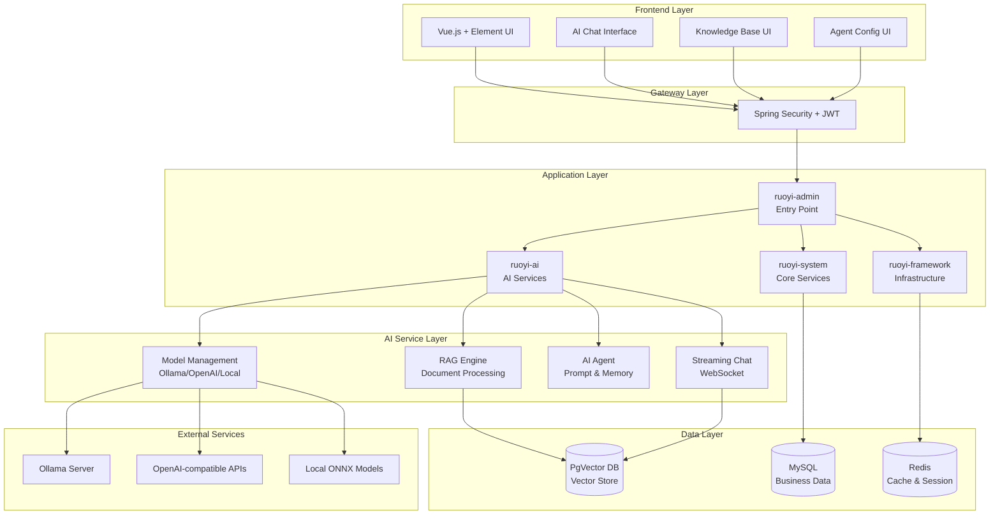

**RuoYi-LangChain4j** is an enterprise-grade AI application platform that seamlessly integrates the mature administrative framework of RuoYi with the powerful AI capabilities of LangChain4j. This fusion creates a production-ready foundation for building intelligent business applications that require both robust backend management and cutting-edge AI functionality. The platform provides out-of-the-box support for AI model management, knowledge base construction with RAG (Retrieval-Augmented Generation), intelligent agent configuration, and real-time streaming chat interfaces—all within a permission-controlled enterprise environment.

Sources: [README.md](README.md#L1-L110), [pom.xml](pom.xml#L1-L200)

## Core Architecture

The platform follows a **layered microservices architecture** where each module has a well-defined responsibility scope. The AI capabilities are encapsulated within the dedicated `ruoyi-ai` module, which integrates with LangChain4j's abstraction layer to support multiple AI providers while maintaining clean separation from business logic. This design allows enterprises to switch between different LLM providers (Ollama, OpenAI-compatible APIs, or local ONNX models) without modifying application code, while the RuoYi foundation provides battle-tested implementations for user management, role-based access control, and workflow orchestration.

Sources: [ruoyi-ai/pom.xml](ruoyi-ai/pom.xml#L1-L69), [Langchain4jConfig.java](ruoyi-ai/src/main/java/com/ruoyi/ai/config/Langchain4jConfig.java#L1-L34)



## Key Capabilities

The platform delivers **four cornerstone AI features** that work in concert to enable intelligent application development. **AI Model Management** provides a unified abstraction layer for LLM and embedding models, supporting both cloud-based providers (Ollama, OpenAI-compatible) and local ONNX deployments for data-sensitive environments. **Knowledge Base with RAG** enables enterprises to build domain-specific knowledge repositories where documents are automatically segmented, vectorized, and indexed using PgVector, allowing AI agents to retrieve relevant context during conversations. **AI Agent Configuration** empowers administrators to define intelligent assistants with custom system prompts, user prompt templates, memory settings, and client-specific rate limiting—making it possible to deploy multiple specialized agents for different business scenarios. **Streaming Chat Implementation** delivers real-time conversational experiences through Server-Sent Events (SSE) with support for deep-thinking UI rendering, session management, and conversation history persistence.

Sources: [AiChatController.java](ruoyi-ai/src/main/java/com/ruoyi/ai/controller/AiChatController.java#L1-L80), [ModelProvider.java](ruoyi-ai/src/main/java/com/ruoyi/ai/enums/ModelProvider.java#L1-L26)

## Technology Stack

| Layer | Technology | Purpose | Version |
|-------|------------|---------|---------|
| **Backend Framework** | Spring Boot | Core application framework | 2.5.15 |
| **Security** | Spring Security + JWT | Authentication & authorization | 5.7.12 |
| **AI Integration** | LangChain4j | LLM abstraction & RAG framework | 1.3.0 |
| **Vector Database** | PostgreSQL + PgVector | Vector similarity search | 15.x |
| **Relational Database** | MySQL | Business data storage | 8.x |
| **Cache** | Redis | Session & performance cache | 6.x |
| **Frontend Framework** | Vue.js | SPA framework | 2.x |
| **UI Components** | Element UI | UI component library | 2.x |
| **Build Tool** | Maven | Dependency management | 3.x |
| **Runtime** | Java | JVM platform | 21 |

The technology choices reflect a **balance between enterprise stability and AI innovation**. Spring Boot 2.5.15 with Spring Security 5.7.12 represents a mature, well-tested foundation, while Java 21 enables modern language features. LangChain4j 1.3.0 provides cutting-edge AI capabilities with a clean abstraction that shields applications from provider-specific implementations. The dual-database architecture—MySQL for transactional consistency and PgVector for vector similarity search—follows the principle of using the right tool for the job, where PgVector's extension-based approach allows PostgreSQL to handle both structured and vector data within a single query engine.

Sources: [pom.xml](pom.xml#L20-L48), [docker-compose-pgvector.yml](docker-compose-pgvector.yml#L1-L51)

## Project Structure

The repository follows the **standard Maven multi-module pattern** where each module encapsulates a cohesive set of functionality. The `ruoyi-admin` module serves as the application entry point, aggregating dependencies from other modules while the `ruoyi-ai` module isolates all AI-related functionality—ensuring that AI features can be developed, tested, and scaled independently from the core business logic. This modular design enables enterprises to adopt AI capabilities incrementally, starting with basic chatbot features and progressively adding knowledge bases, custom agents, and vector search as their AI maturity grows.

Sources: [README.md](README.md#L1-L110), [pom.xml](pom.xml#L1-L200)

```
ruoyi-langchain4j/
├── ruoyi-admin/           # Application entry point
│   └── src/main/resources/
│       └── application.yml
├── ruoyi-ai/              # AI capabilities module (CORE)
│   ├── config/            # AI & LangChain4j configuration
│   ├── controller/        # REST API endpoints
│   ├── domain/            # Entity models
│   ├── enums/             # Model provider types
│   ├── mapper/            # Database access layer
│   ├── service/           # Business logic & AI integration
│   └── util/              # AI utilities (PgVector, ModelScope)
├── ruoyi-common/          # Shared utilities & helpers
├── ruoyi-framework/       # Core infrastructure (Security, Cache)
├── ruoyi-system/          # System management (User, Role, Menu)
├── ruoyi-quartz/          # Scheduled task management
├── ruoyi-generator/       # Code generation tools
├── ruoyi-ui/              # Vue.js frontend application
│   └── src/views/ai/      # AI feature UI components
│       ├── agent/         # Agent configuration interface
│       ├── knowledgeBase/ # Knowledge base management UI
│       └── model/         # Model management interface
├── sql/                   # Database initialization scripts
└── doc/                   # Documentation & guides
```

## Who Should Use This Platform

This platform is designed for **three primary user personas** seeking to accelerate their AI application development. **Enterprise Developers** who need a production-ready administrative system with integrated AI capabilities will find a complete solution that eliminates the need to build authentication, role management, and audit logging from scratch while gaining immediate access to RAG-based knowledge retrieval and conversational AI. **AI Application Architects** evaluating different LLM providers will appreciate the abstraction layer that allows performance benchmarking across Ollama, OpenAI, and local models without code changes—the platform serves as a reference implementation for clean architecture in AI systems. **DevOps Engineers** responsible for deploying AI services in regulated environments will benefit from Docker-first deployment strategies, local ONNX model support for air-gapped networks, and comprehensive monitoring through the integrated system management interface.

Sources: [README.md](README.md#L15-L45)

## Getting Started Pathway

Begin your journey by understanding the **deployment requirements** and **configuration patterns** that power the platform. The recommended reading sequence starts with [Quick Start](2-quick-start) to launch a minimal development environment, followed by [Technology Stack](3-technology-stack) for a deeper understanding of component interactions, and [Project Structure](4-project-structure) for module-level architectural insights. Once you have a running instance, explore [Demo Account](5-demo-account) credentials to experience the AI features firsthand—then dive into specific capabilities like [AI Model Management](6-ai-model-management) and [Knowledge Base with RAG](7-knowledge-base-with-rag) to understand implementation details. For production deployments, [Docker Deployment](15-docker-deployment) and [Database Schema](16-database-schema) provide essential operational guidance.