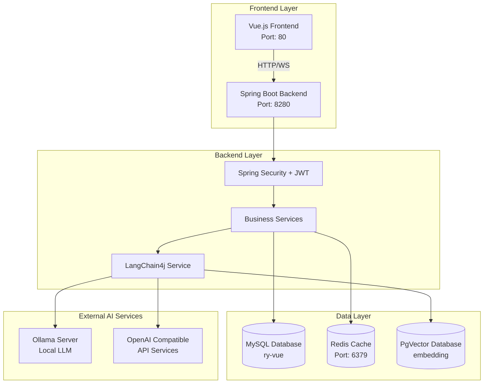
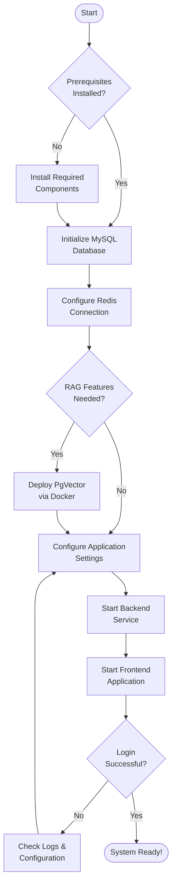

This guide provides a streamlined approach to get the RuoYi-LangChain4j system up and running on your local development environment. The platform integrates AI capabilities with a robust enterprise management framework, enabling developers to quickly deploy and experiment with RAG (Retrieval-Augmented Generation) features, AI model management, and intelligent agent configuration.

## System Architecture Overview

The system follows a classic three-tier architecture with an additional vector database layer for AI capabilities. The backend leverages Spring Boot with LangChain4j for AI integration, while the frontend uses Vue.js with Element UI for an intuitive user interface.



Sources: [application.yml](ruoyi-admin/src/main/resources/application.yml#L1-L149), [pom.xml](pom.xml#L1-L200)

## Prerequisites

Before beginning the installation, ensure your development environment meets the following requirements. The system requires Java 21 for optimal compatibility with LangChain4j features, along with standard database and caching infrastructure.

| Component | Required Version | Purpose | Notes |
|-----------|-----------------|---------|-------|
| **Java JDK** | 21+ | Backend runtime | Required for LangChain4j compatibility |
| **Maven** | 3.6+ | Build tool | For compiling backend services |
| **MySQL** | 5.7+ / 8.0+ | Primary database | Stores system data and user management |
| **Redis** | 5.0+ | Cache layer | Session management and performance optimization |
| **Node.js** | 8.9+ | Frontend runtime | Vue.js development environment |
| **npm** | 3.0.0+ | Package manager | Frontend dependency management |
| **Docker** | Latest (Optional) | PgVector deployment | Required only for local RAG features |

Sources: [pom.xml](pom.xml#L30-L31), [package.json](ruoyi-ui/package.json#L65-L67)

## Quick Start Flowchart

Follow this systematic approach to deploy the system. Each step builds upon the previous, ensuring a stable foundation before proceeding to more complex configurations.



Sources: [application.yml](ruoyi-admin/src/main/resources/application.yml#L1-L149), [docker-compose-pgvector.yml](docker-compose-pgvector.yml#L1-L51)

## Step 1: Database Initialization

### MySQL Database Setup

The system requires MySQL for storing user data, system configurations, and business logic. Execute the provided SQL scripts to initialize the database schema and populate essential data.

**Database Configuration:**
- **Database Name:** `ry-vue`
- **Default Credentials:** `root` / `root` (change in production)

**Initialization Commands:**

```sql
-- Create database
CREATE DATABASE `ry-vue` CHARACTER SET utf8mb4 COLLATE utf8mb4_general_ci;

-- Import main schema and initial data
USE `ry-vue`;
SOURCE sql/ry_20250522.sql;

-- Import scheduled tasks tables (optional, for Quartz jobs)
SOURCE sql/quartz.sql;
```

The main SQL script creates 18 essential tables including user management (`sys_user`), department structure (`sys_dept`), menu permissions (`sys_menu`), and role configurations (`sys_role`). The Quartz script adds 11 tables for scheduled task management. After successful import, verify the installation by checking that at least one admin user exists in the `sys_user` table.

Sources: [ry_20250522.sql](sql/ry_20250522.sql#L1-L50), [quartz.sql](sql/quartz.sql#L1-L30), [application-druid.yml](ruoyi-admin/src/main/resources/application-druid.yml#L8-L11)

## Step 2: Redis Configuration

Redis serves as the distributed cache layer, managing user sessions, JWT token storage, and frequently accessed data. The default configuration expects Redis to run locally with password authentication.

**Default Redis Settings:**
- **Host:** `127.0.0.1`
- **Port:** `6379`
- **Password:** `123456`
- **Database Index:** `0`

If your Redis configuration differs, modify the connection parameters in the application configuration file. For production environments, consider using Redis Sentinel or Redis Cluster for high availability.

Sources: [application.yml](ruoyi-admin/src/main/resources/application.yml#L59-L71)

## Step 3: PgVector Deployment (Optional)

For developers intending to use local RAG (Retrieval-Augmented Generation) features, PgVector provides vector similarity search capabilities. The project includes a Docker Compose configuration for easy deployment.

**Deployment Command:**

```bash
docker-compose -f docker-compose-pgvector.yml up -d
```

**PgVector Configuration:**
- **Host:** `127.0.0.1`
- **Port:** `5432`
- **Database:** `embedding`
- **Credentials:** `root` / `root`
- **Vector Dimension:** `768` (compatible with text2vec-base-chinese model)

The configuration uses a pre-built image with both PgVector and VectorChord extensions, optimized for Chinese text embeddings. The container persists data in the `./postgres-data` directory, ensuring data survival across container restarts.

Sources: [docker-compose-pgvector.yml](docker-compose-pgvector.yml#L1-L51), [application.yml](ruoyi-admin/src/main/resources/application.yml#L142-L149)

## Step 4: Application Configuration

The system uses Spring Boot's externalized configuration pattern. Key configuration files reside in `ruoyi-admin/src/main/resources/`. Review and adjust the following parameters based on your environment:

| Configuration File | Purpose | Key Parameters |
|-------------------|---------|----------------|
| **application.yml** | Main configuration | Server port: `8280`, Profile path, Redis settings |
| **application-druid.yml** | Database connection | MySQL URL, credentials, connection pool |
| **banner.txt** | Startup banner | Custom ASCII art display |

**Critical Configuration Points:**

1. **File Upload Path** (Windows: `D:/ruoyi/uploadPath`, Linux: `/home/ruoyi/uploadPath`)
2. **JWT Token Secret** and expiration time (default: 30 minutes)
3. **PgVector Connection** for AI features (must match Docker deployment)

If you're running on a different port or database credentials, update these values before starting the application to avoid connection failures.

Sources: [application.yml](ruoyi-admin/src/main/resources/application.yml#L3-L5), [application-druid.yml](ruoyi-admin/src/main/resources/application-druid.yml#L5-L16)

## Step 5: Backend Service Startup

The backend service is a Spring Boot application that can be started through multiple methods. Choose the approach that best fits your development workflow.

### Method 1: Using Startup Scripts (Recommended)

**Windows:**
```cmd
# Build the project first
mvn clean install

# Run using provided script
ry.bat
# Select option [1] to start
```

**Linux/Mac:**
```bash
# Build and start
mvn clean install
./ry.sh start
```

The startup scripts include JVM optimization parameters, setting initial heap size to 512MB and maximum to 1024MB, suitable for development environments. They also configure garbage collection logging and timezone settings.

### Method 2: Direct JAR Execution

```bash
cd ruoyi-admin/target
java -jar ruoyi-admin.jar
```

### Method 3: Maven Spring Boot Plugin

```bash
cd ruoyi-admin
mvn spring-boot:run
```

After successful startup, you'll see the RuoYi ASCII banner in the console, indicating the application has initialized correctly. The backend service listens on port **8280** by default.

Sources: [ry.bat](ry.bat#L1-L68), [ry.sh](ry.sh#L1-L87), [RuoYiApplication.java](ruoyi-admin/src/main/java/com/ruoyi/RuoYiApplication.java#L19-L29), [bin/run.bat](bin/run.bat#L1-L14)

## Step 6: Frontend Application Startup

The frontend is built with Vue.js 2.6 and Element UI, providing a responsive management interface. Install dependencies and start the development server using npm.

**Installation and Startup:**

```bash
cd ruoyi-ui

# Install dependencies (first time only)
npm install

# Start development server
npm run dev
```

The development server automatically proxies API requests to the backend through `/dev-api` prefix, configured in the Vue CLI settings. The WebSocket connection for real-time notifications points to `ws://127.0.0.1:8280/websocket/message`.

**Frontend Configuration:**
- **Development API:** `http://localhost:8280` (proxied as `/dev-api`)
- **WebSocket:** `ws://127.0.0.1:8280/websocket/message`
- **Default Port:** `80` (or next available port)

After startup, access the application at `http://localhost:80`. The browser will display the login page, ready for authentication.

Sources: [package.json](ruoyi-ui/package.json#L1-L75), [.env.development](ruoyi-ui/.env.development#L1-L15)

## Step 7: System Verification

Verify successful deployment by logging in with the default administrator account and checking core functionalities.

**Default Login Credentials:**
- **Username:** `admin`
- **Password:** `admin123`

**Verification Checklist:**

| Feature | Verification Method | Expected Result |
|---------|-------------------|-----------------|
| **User Authentication** | Login with admin account | Redirect to dashboard |
| **Menu Navigation** | Click sidebar menu items | Pages load without errors |
| **Database Connection** | Check system management modules | Data displays correctly |
| **Redis Connection** | Login and check online users | Session persists correctly |
| **AI Features** | Navigate to AI Toolbox | Model management accessible |
| **WebSocket** | Upload document for vectorization | Real-time progress updates |

Upon successful login, you'll see the main dashboard with system statistics. Navigate to **AI Toolbox** in the sidebar to access AI model management, knowledge base configuration, and intelligent agent setup—these are the core AI features that distinguish this platform from standard RuoYi-Vue deployments.

Sources: [README.md](README.md#L53-L54), [README.md](README.md#L19-L23)

## Configuration Reference Summary

This table provides a quick reference for all configurable parameters across different environment tiers:

| Tier | Component | Configuration File | Key Settings |
|------|-----------|-------------------|--------------|
| **Frontend** | Vue.js | `.env.development` | API base URL, WebSocket endpoint |
| **Backend** | Server | `application.yml` | Port 8280, context path, file upload |
| **Backend** | Database | `application-druid.yml` | MySQL connection, pool settings |
| **Backend** | Cache | `application.yml` | Redis host, port, password |
| **Backend** | AI | `application.yml` | PgVector connection, model settings |
| **Infrastructure** | PgVector | `docker-compose-pgvector.yml` | Container resources, persistence |

Sources: [application.yml](ruoyi-admin/src/main/resources/application.yml#L1-L149), [application-druid.yml](ruoyi-admin/src/main/resources/application-druid.yml#L1-L62), [docker-compose-pgvector.yml](docker-compose-pgvector.yml#L1-L51)

## Next Steps

Now that your system is running, explore these comprehensive guides to unlock the full potential of RuoYi-LangChain4j:

- **[Technology Stack](3-technology-stack)** - Understand the architectural decisions and technology choices behind the platform
- **[Project Structure](4-project-structure)** - Navigate the codebase efficiently with detailed module breakdown
- **[AI Model Management](6-ai-model-management)** - Configure and manage LLM and embedding models for your use cases
- **[Knowledge Base with RAG](7-knowledge-base-with-rag)** - Build intelligent knowledge retrieval systems using vector databases
- **[Docker Deployment](15-docker-deployment)** - Deploy to production environments with containerization

For troubleshooting and advanced configurations, refer to the [Application Configuration](14-application-configuration) guide. The system's modular architecture allows you to progressively adopt AI features while maintaining the stability of traditional enterprise management functions.