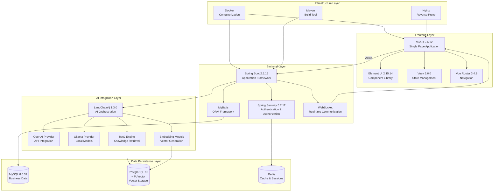

This document provides a comprehensive overview of the technology stack powering the RuoYi-LangChain4j AI platform, designed to help beginner developers understand the architectural layers and their interconnections.

## Architecture Overview

The platform follows a **layered architecture pattern** with clear separation between frontend presentation, backend business logic, data persistence, and AI integration layers. This design enables independent scaling, easier maintenance, and straightforward component replacement.



Sources: [pom.xml](pom.xml#L15-L40), [package.json](ruoyi-ui/package.json#L1-L75)

## Backend Technology Stack

The backend is built on the **Spring ecosystem**, leveraging mature enterprise-grade frameworks for robust application development.

### Core Framework Components

| Component | Version | Purpose |
|-----------|---------|---------|
| **Java** | 21 | Runtime platform (modern LTS version) |
| **Spring Boot** | 2.5.15 | Application framework with auto-configuration |
| **Spring Framework** | 5.3.39 | Core dependency injection and MVC |
| **Spring Security** | 5.7.12 | Authentication and authorization |
| **MyBatis** | - | SQL mapping and ORM framework |
| **PageHelper** | 1.4.7 | Database pagination plugin |
| **Druid** | 1.2.23 | Database connection pool with monitoring |

Sources: [pom.xml](pom.xml#L15-L40)

### Database & Caching Technologies

The platform employs a **hybrid database strategy** where MySQL handles traditional business data while PostgreSQL with PgVector extension manages vector embeddings for AI operations.

| Technology | Version | Role |
|------------|---------|------|
| **MySQL** | 8.0.39 | Primary business data storage (users, roles, configurations) |
| **PostgreSQL** | 15 | Vector database with PgVector extension for embedding storage |
| **Redis** | Alpine | Session management, caching, and distributed locks |

The PostgreSQL configuration includes **vector optimization parameters** with tuned memory settings for efficient similarity search operations.

Sources: [docker-compose.yml](docker-compose.yml#L37-L84), [application.yml](ruoyi-admin/src/main/resources/application.yml#L105-L148)

### Security & Authentication

Security is implemented through **JWT-based stateless authentication** integrated with Spring Security's filter chain:

| Component | Version | Function |
|-----------|---------|----------|
| **JWT (JJWT)** | 0.9.1 | Token generation and validation |
| **Spring Security** | 5.7.12 | Access control and authentication filters |
| **Kaptcha** | 2.3.3 | CAPTCHA verification for login protection |

Sources: [pom.xml](pom.xml#L32-L36), [pom.xml](pom.xml#L181-L186)

### Utility Libraries

| Library | Version | Use Case |
|---------|---------|----------|
| **Hutool** | 5.8.9 | Comprehensive Java utility toolkit |
| **Fastjson2** | 2.0.57 | High-performance JSON serialization |
| **Apache POI** | 4.1.2 | Excel import/export functionality |
| **Apache Velocity** | 2.3 | Template engine for code generation |
| **Swagger** | 3.0.0 | API documentation and testing UI |

Sources: [pom.xml](pom.xml#L27-L32), [ruoyi-common/pom.xml](ruoyi-common/pom.xml#L122-L126)

## AI Integration Stack

The AI capabilities are powered by **LangChain4j**, providing unified abstractions over multiple AI model providers and enabling sophisticated RAG (Retrieval-Augmented Generation) workflows.

### LangChain4j Ecosystem

| Module | Purpose |
|--------|---------|
| **langchain4j-core** | Core APIs and abstractions |
| **langchain4j-open-ai** | OpenAI API integration (compatible providers) |
| **langchain4j-ollama** | Local model integration via Ollama |
| **langchain4j-easy-rag** | Simplified RAG implementation |
| **langchain4j-pgvector** | PgVector embedding store integration |
| **langchain4j-embeddings-all-minilm-l6-v2** | Local ONNX embedding model |

The architecture supports **dual embedding strategies**: cloud-based models via OpenAI-compatible APIs or local ONNX models for air-gapped deployments.

Sources: [ruoyi-ai/pom.xml](ruoyi-ai/pom.xml#L36-L59)

### Vector Storage Configuration

PgVector is configured with **768-dimensional embeddings** for Chinese text (text2vec-base-chinese model), optimized for semantic similarity search:

```yaml
ai:
  pgVector:
    host: 127.0.0.1
    port: 5432
    database: embedding
    table: embedding
    dimension: 768
```

Sources: [application.yml](ruoyi-admin/src/main/resources/application.yml#L137-L148)

## Frontend Technology Stack

The frontend follows the **Vue.js 2.x ecosystem** with Element UI for enterprise-grade user interfaces, providing a responsive and feature-rich admin dashboard.

### Core Framework & Libraries

| Technology | Version | Role |
|------------|---------|------|
| **Vue.js** | 2.6.12 | Progressive JavaScript framework |
| **Element UI** | 2.15.14 | Enterprise-grade UI component library |
| **Vuex** | 3.6.0 | Centralized state management |
| **Vue Router** | 3.4.9 | SPA navigation management |

Sources: [package.json](ruoyi-ui/package.json#L27-L43)

### UI Enhancement Libraries

| Library | Version | Purpose |
|---------|---------|---------|
| **Echarts** | 5.4.0 | Data visualization and charts |
| **Markdown-it** | ^14.1.0 | Markdown rendering for AI chat responses |
| **Quill** | 2.0.2 | Rich text editor for content management |
| **Highlight.js** | ^9.18.5 | Syntax highlighting in code blocks |
| **Vue-cropper** | 0.5.5 | Image cropping for avatar uploads |

Sources: [package.json](ruoyi-ui/package.json#L27-L43)

### Build Tools & Development

| Tool | Version | Function |
|------|---------|----------|
| **Vue CLI** | 4.4.6 | Project scaffolding and build pipeline |
| **Sass** | 1.32.13 | CSS preprocessor for styling |
| **Axios** | 0.28.1 | Promise-based HTTP client |
| **js-cookie** | 3.0.1 | Cookie manipulation utilities |

Sources: [package.json](ruoyi-ui/package.json#L53-L61)

## Development & Deployment Infrastructure

### Build & Package Management

The project uses **Maven** for backend dependency management and build automation, with multi-module project structure enabling independent compilation and deployment:

```
ruoyi-langchain4j (root)
├── ruoyi-admin       # Web application entry point
├── ruoyi-framework   # Core framework components
├── ruoyi-system      # System management module
├── ruoyi-common      # Shared utilities
├── ruoyi-ai          # AI integration module
├── ruoyi-quartz      # Scheduled tasks
└── ruoyi-generator   # Code generation tool
```

Sources: [pom.xml](pom.xml#L7-L10), [ruoyi-admin/pom.xml](ruoyi-admin/pom.xml#L70-L98)

### Containerization Strategy

**Docker Compose** orchestrates all services with health checks and resource limits:

- **MySQL 8.0.39**: Business data persistence with UTF-8mb4 character set
- **PostgreSQL 15**: Vector database with optimized configuration (256MB shared buffers, 768MB cache)
- **Redis**: Session and cache storage
- **Application containers**: Frontend (Nginx-based) and backend (Spring Boot)

Sources: [docker-compose.yml](docker-compose.yml#L1-L121)

### Web Server Configuration

**Nginx** serves as the reverse proxy for the frontend SPA, handling static file delivery and API request routing to the backend application server.

Sources: [nginx.conf](nginx.conf#L1)

## Next Steps

Now that you understand the technology stack, explore these topics to deepen your knowledge:

- **[Project Structure](4-project-structure)** - Learn how modules are organized and their responsibilities
- **[Application Configuration](14-application-configuration)** - Detailed configuration guide for all components
- **[Docker Deployment](15-docker-deployment)** - Step-by-step deployment instructions
- **[AI Model Management](6-ai-model-management)** - Configure and manage AI model providers
- **[LangChain4j Service Layer](12-langchain4j-service-layer)** - Deep dive into AI integration architecture