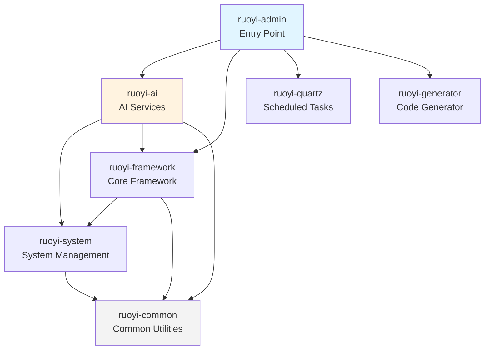

This page provides a comprehensive architectural overview of the RuoYi-LangChain4j project structure, designed for intermediate developers who need to understand the system's organization before diving into implementation details. The project integrates the RuoYi enterprise management framework with LangChain4j AI capabilities, creating a production-ready AI-powered business application platform.

## Architecture Overview

The RuoYi-LangChain4j project follows a modular Maven multi-module architecture that separates concerns across seven distinct modules, each responsible for specific functionality domains. This architectural pattern enables independent development, testing, and deployment of different system components while maintaining clear boundaries between business logic, AI capabilities, and infrastructure concerns.

The system employs a layered architecture where the **ruoyi-admin** module serves as the web service entry point, orchestrating dependencies from other modules to provide a unified Spring Boot application. The AI capabilities are isolated within the **ruoyi-ai** module, which integrates LangChain4j framework components including OpenAI, Ollama, and PgVector connectors, ensuring that AI-specific logic remains decoupled from traditional business operations.

Sources: [pom.xml](pom.xml#L1-L313), [ruoyi-admin/pom.xml](ruoyi-admin/pom.xml#L1-L100)

## Module Dependency Hierarchy

The project implements a hierarchical dependency structure where modules depend on each other in a controlled manner, preventing circular dependencies and ensuring clear separation of concerns. The following diagram illustrates the module dependency relationships:



The **ruoyi-common** module sits at the foundation of the dependency hierarchy, providing shared utilities, constants, and foundational classes used across all other modules. The **ruoyi-system** module depends on common utilities to implement core business features like user management, role management, and permission control. The **ruoyi-framework** module builds upon system components to provide security configuration, caching, logging, and other cross-cutting concerns.

Sources: [pom.xml](pom.xml#L262-L270), [ruoyi-ai/pom.xml](ruoyi-ai/pom.xml#L1-L69)

## Module Responsibilities

Each module encapsulates a specific domain of functionality, enabling teams to work independently on different features without interfering with other parts of the system. The following table summarizes the primary responsibilities and key components of each module:

| Module | Artifact ID | Primary Responsibility | Key Components |
|--------|-------------|----------------------|----------------|
| **ruoyi-admin** | ruoyi-admin | Application entry point, REST API endpoints | RuoYiApplication.java, System Controllers, Monitor Controllers |
| **ruoyi-ai** | ruoyi-ai | AI/ML service integration, LangChain4j orchestration | Model Controllers, Chat Controllers, Knowledge Base Services |
| **ruoyi-framework** | ruoyi-framework | Security, caching, logging, WebSocket infrastructure | SecurityConfig, RedisConfig, WebSocketConfig |
| **ruoyi-system** | ruoyi-system | Core business domain models and services | User/Role/Menu/Dept Services and Mappers |
| **ruoyi-common** | ruoyi-common | Shared utilities, constants, annotations | StringUtils, DateUtils, Constants, Annotations |
| **ruoyi-quartz** | ruoyi-quartz | Scheduled task management | QuartzJobBean implementations, Job Controllers |
| **ruoyi-generator** | ruoyi-generator | Code generation tooling | Template engines, GeneratorService |

The **ruoyi-ai** module represents the most significant addition to the traditional RuoYi framework, incorporating comprehensive AI capabilities including model management, chat services, knowledge base operations, and intelligent agent configuration. This module directly integrates LangChain4j dependencies for multiple AI providers including OpenAI and Ollama, along with PgVector for vector storage operations.

Sources: [ruoyi-ai/pom.xml](ruoyi-ai/pom.xml#L37-L59), [README.md](README.md#L4-L9)

## Backend Package Structure

The backend follows standard Spring Boot conventions with a clear package hierarchy that promotes maintainability and testability. Each module organizes its code into distinct layers: controllers for HTTP request handling, services for business logic, mappers for data access, domains for entity models, and configuration classes for framework integration.

**ruoyi-admin** package organization:
```
com.ruoyi
├── RuoYiApplication.java         # Spring Boot entry point
├── web.controller
│   ├── common                    # Captcha, file upload
│   ├── monitor                   # Cache, server metrics
│   ├── system                    # User, role, menu management
│   └── tool                      # Code generation tools
└── web.core.config               # Swagger configuration
```

**ruoyi-ai** package organization demonstrates the AI module's comprehensive structure:
```
com.ruoyi.ai
├── config                        # AiConfig, Langchain4jConfig
├── controller                    # Model, Chat, Knowledge Base endpoints
│   └── model                     # Request/Response DTOs
├── domain                        # Entity classes (Model, AiAgent, KnowledgeBase)
├── enums                         # ModelProvider, ModelType enumerations
├── mapper                        # MyBatis data access interfaces
├── service                       # Business logic interfaces
│   └── impl                      # Service implementations
└── util                          # PgVectorUtil, ModelScopeUtil
```

The **ruoyi-ai** module's service layer includes a dedicated **LangChain4jService** that orchestrates AI model interactions, **ModelBuilder** for constructing LangChain4j model instances, and specialized services for knowledge base management and chat message persistence. This structure ensures that AI-related business logic remains isolated from traditional CRUD operations.

Sources: [ruoyi-admin/src/main/java/com/ruoyi/RuoYiApplication.java](ruoyi-admin/src/main/java/com/ruoyi/RuoYiApplication.java#L1), [ruoyi-ai/src/main/java/com/ruoyi/ai/service/LangChain4jService.java](ruoyi-ai/src/main/java/com/ruoyi/ai/service/LangChain4jService.java#L1)

## Frontend Architecture

The frontend application resides in the **ruoyi-ui** directory and implements a Vue.js 2.6.12 single-page application using the Element UI component library. The architecture follows Vuex for state management and Vue Router for navigation, creating a responsive admin dashboard interface that communicates with backend REST APIs through Axios HTTP client.

```
ruoyi-ui/src
├── api                           # API request modules
│   ├── ai                        # AI-specific API calls
│   │   ├── agent.js              # Intelligent agent operations
│   │   ├── aiChat.js             # Chat streaming endpoints
│   │   ├── knowledgeBase.js      # Knowledge base CRUD
│   │   └── model.js              # Model management
│   ├── system                    # System management APIs
│   └── monitor                   # Monitoring APIs
├── components                    # Reusable Vue components
│   ├── Markdown                  # Markdown rendering component
│   ├── Pagination                # Data pagination
│   └── [20+ other components]
├── views                         # Page-level components
│   ├── ai                        # AI feature views
│   │   ├── agent                 # Agent configuration UI
│   │   ├── knowledgeBase         # Knowledge base management
│   │   └── model                 # Model management interface
│   ├── system                    # System management views
│   └── dashboard                 # Dashboard layouts
├── store                         # Vuex state management
├── router                        # Vue Router configuration
└── utils                         # Utility functions
```

The AI-specific frontend modules in **views/ai** and **api/ai** directories directly correspond to the backend's AI controller endpoints, providing user interfaces for model configuration, knowledge base document management, intelligent agent setup, and real-time chat interactions with streaming responses.

Sources: [ruoyi-ui/package.json](ruoyi-ui/package.json#L1-L75), [ruoyi-ui/src/views/ai/](ruoyi-ui/src/views/ai#L1)

## Configuration Files

The project stores configuration files in the **ruoyi-admin/src/main/resources** directory, following Spring Boot's convention of externalizing configuration through YAML files. Understanding the configuration structure is essential for deployment and environment customization.

| Configuration File | Purpose | Key Settings |
|-------------------|---------|--------------|
| **application.yml** | Main Spring Boot configuration | Server port, Spring profiles, Application name |
| **application-druid.yml** | Database connection pool config | MySQL connection URL, Druid pool settings |
| **logback.xml** | Logging configuration | Log levels, file appenders, pattern layouts |
| **banner.txt** | Application startup banner | Custom ASCII art for console output |
| **mybatis/** | MyBatis mapper XML files | SQL mapping configurations |
| **i18n/** | Internationalization resources | Multi-language message bundles |

The main application configuration typically references environment-specific settings through Spring profiles, allowing different configurations for development, testing, and production environments. Developers should examine these configuration files to understand database connections, Redis settings, and AI model provider credentials required for runtime operation.

Sources: [ruoyi-admin/src/main/resources/application.yml](ruoyi-admin/src/main/resources/application.yml#L1), [ruoyi-admin/src/main/resources/application-druid.yml](ruoyi-admin/src/main/resources/application-druid.yml#L1)

## Technology Stack Integration

The project's technology stack combines enterprise-grade Java frameworks with cutting-edge AI libraries, requiring careful version management to ensure compatibility. The root **pom.xml** defines centralized dependency versions that cascade to all modules through Maven's dependency management mechanism.

**Core Backend Technologies**:
- Java 21 (LTS version)
- Spring Boot 2.5.15 with Spring Framework 5.3.39
- Spring Security 5.7.12 for authentication and authorization
- MyBatis for persistence with PageHelper for pagination
- Druid connection pool for MySQL database management
- Redis for caching and session management
- JWT for stateless authentication tokens

**AI Integration Stack**:
- LangChain4j 1.3.0 (core framework)
- LangChain4j OpenAI connector for OpenAI-compatible APIs
- LangChain4j Ollama connector for local model deployment
- LangChain4j PgVector for vector database operations
- LangChain4j Easy-RAG for simplified retrieval-augmented generation
- LangChain4j Embeddings (all-minilm-l6-v2) for local embedding generation

**Frontend Stack**:
- Vue.js 2.6.12 with Vuex 3.6.0 for state management
- Vue Router 3.4.9 for navigation
- Element UI 2.15.14 for UI components
- Axios 0.28.1 for HTTP requests
- Markdown-it 14.1.0 for rendering AI responses
- Echarts 5.4.0 for data visualization

Sources: [pom.xml](pom.xml#L15-L40), [pom.xml](pom.xml#L229-L258), [ruoyi-ui/package.json](ruoyi-ui/package.json#L26-L52)

## Build and Deployment Artifacts

The project provides multiple build and deployment mechanisms for different operational scenarios. Maven handles backend compilation and packaging, while npm manages frontend asset bundling. Docker support enables containerized deployment for production environments.

**Build Scripts and Directories**:
- **pom.xml**: Maven parent POM defining module aggregation
- **build.sh**: Shell script for Unix/Linux build automation
- **bin/package.bat**: Windows batch script for packaging
- **bin/run.bat**: Windows startup script
- **Dockerfile-admin**: Container definition for backend service
- **Dockerfile-ui**: Container definition for frontend service
- **docker-compose.yml**: Multi-container orchestration
- **docker-compose-pgvector.yml**: PgVector database container setup

The **ruoyi-admin** module produces a single executable JAR file through Spring Boot Maven Plugin's repackage goal, creating a fat JAR that embeds all dependencies. This artifact serves as the standalone application entry point that can be deployed to any Java 21 runtime environment.

Sources: [pom.xml](pom.xml#L273-L286), [ruoyi-admin/pom.xml](ruoyi-admin/pom.xml#L70-L98), [docker-compose-pgvector.yml](docker-compose-pgvector.yml#L1)

## Next Steps

Now that you understand the overall project structure, you should explore the core AI capabilities that define this system's unique value proposition. The recommended reading progression guides you through progressively deeper technical topics:

1. **[AI Model Management](6-ai-model-management)** - Learn how the system manages and configures different AI models
2. **[Knowledge Base with RAG](7-knowledge-base-with-rag)** - Understand document processing and vector storage
3. **[AI Agent Configuration](8-ai-agent-configuration)** - Explore intelligent agent setup and prompt engineering
4. **[Streaming Chat Implementation](9-streaming-chat-implementation)** - Discover real-time chat architecture details

For deployment-focused readers, consider reviewing **[Application Configuration](14-application-configuration)** and **[Docker Deployment](15-docker-deployment)** to set up your development or production environment.