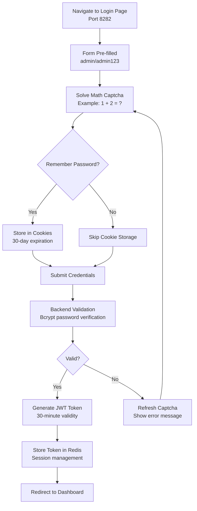
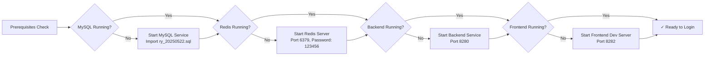

The demo account provides immediate access to explore the RuoYi AI Agent System without the need for initial user configuration. This pre-configured administrator account enables developers to quickly experience the full range of AI capabilities including model management, knowledge base configuration, and intelligent agent deployment. The system ships with a default administrator credential that has comprehensive permissions across all modules, making it ideal for initial system evaluation and development testing.

## Default Credentials

The primary demo account is automatically created during database initialization with full administrative privileges. This account is pre-populated in the login form to streamline the initial access experience.

| Attribute | Value | Description |
|-----------|-------|-------------|
| **Username** | `admin` | System administrator account |
| **Password** | `admin123` | Default password (bcrypt encrypted in database) |
| **Role** | Super Administrator (超级管理员) | Full system access with all permissions |
| **Department** | Research & Development (研发部门) | Organizational unit assignment |
| **Email** | ry@163.com | Contact information |
| **Phone** | 15888888888 | Contact number |

Sources: [sql/ry_20250522.sql](sql/ry_20250522.sql#L93-L100), [ruoyi-ui/src/views/login.vue](ruoyi-ui/src/views/login.vue#L56-L57)

## Accessible Features

The admin demo account provides unrestricted access to all system functionalities, enabling comprehensive exploration of both traditional enterprise management features and advanced AI capabilities.

### Core System Management
The administrative account grants complete control over user management, role assignment, menu configuration, department hierarchy, and system monitoring. All standard RuoYi-Vue platform features are accessible including code generation tools, scheduled tasks, and operational logging systems.

### AI Toolkit Features
The demo account has full access to the AI module which represents the core innovation of this platform. The AI Toolkit (AI工具箱) menu encompasses three critical subsystems:

**Model Management** enables configuration of both Large Language Models (LLM) and Embedding models from various providers including Ollama, OpenAI-compatible APIs, and local ONNX runtime environments. Users can define model parameters such as temperature settings, maximum output tokens, and API credentials.

**Knowledge Base Management** provides RAG (Retrieval-Augmented Generation) capabilities through document upload, automatic segmentation, and vector storage in PostgreSQL with pgvector extension. Each knowledge base can be associated with multiple AI agents for domain-specific information retrieval.

**AI Agent Configuration** allows creation of intelligent agents with customizable system prompts, memory settings, knowledge base associations, and client-side rate limiting. Agents can be deployed with unique visit URLs and configured with prompt templates for specific use cases.

Sources: [sql/ry_20250522.sql](sql/ry_20250522.sql#L1163-L1273), [README.md](README.md#L68-L68)

## Login Process

The authentication workflow incorporates security mechanisms while maintaining simplicity for demonstration purposes. Understanding this process helps developers implement proper authentication in production environments.

The system employs a multi-layered security approach starting with a mathematical captcha verification to prevent automated attacks. Upon successful credential validation, a JSON Web Token (JWT) is generated with a 30-minute expiration window and stored in Redis for session management. The frontend retrieves user permissions and menu configurations dynamically based on role assignments, ensuring consistent access control across all interface components.

Sources: [ruoyi-ui/src/views/login.vue](ruoyi-ui/src/views/login.vue#L111-L134), [ruoyi-admin/src/main/resources/application.yml](ruoyi-admin/src/main/resources/application.yml#L94-L101)

## Security Considerations

While the demo account facilitates rapid prototyping and learning, several security implications require attention before production deployment.

### Password Security
The default password `admin123` is stored as a bcrypt hash in the database (`$2a$10$7JB720yubVSZvUI0rEqK/.VqGOZTH.ulu33dHOiBE8ByOhJIrdAu2`). Bcrypt's adaptive hashing algorithm with a cost factor of 10 provides strong protection against rainbow table attacks and brute-force attempts. The system enforces a maximum retry count of 5 failed attempts before locking the account for 10 minutes.

### Session Management
JWT tokens expire after 30 minutes of inactivity, requiring re-authentication to maintain security. The token secret key (`abcdefghijklmnopqrstuvwxyz`) should be replaced with a cryptographically secure random string in production environments. Redis-based session storage enables horizontal scaling while maintaining centralized authentication state.

### Access Control Recommendations
For production systems, immediately change the default admin password through the user profile management interface. Consider implementing password complexity requirements and enabling two-factor authentication for administrative accounts. The system's role-based access control (RBAC) framework supports granular permission assignment, allowing creation of limited-access accounts for different organizational roles.

Sources: [ruoyi-admin/src/main/resources/application.yml](ruoyi-admin/src/main/resources/application.yml#L41-L46), [sql/ry_20250522.sql](sql/ry_20250522.sql#L94-L96)

## Secondary Test Account

A secondary account exists in the system for testing role-based access control and limited permission scenarios.

| Attribute | Value |
|-----------|-------|
| **Username** | `ry` |
| **Password** | `admin123` |
| **Role** | Common Role (普通角色) |
| **Department** | Testing Department (测试部门) |

This account has restricted permissions compared to the administrator account, demonstrating the platform's multi-level access control capabilities. Use this account to verify permission boundaries and test user experience for non-administrative roles.

Sources: [sql/ry_20250522.sql](sql/ry_20250522.sql#L97-L100), [sql/ry_20250522.sql](sql/ry_20250522.sql#L488-L491)

## Troubleshooting Common Issues

Beginner developers frequently encounter specific authentication and access challenges. The following solutions address the most common scenarios.

| Issue | Possible Cause | Solution |
|-------|----------------|----------|
| **Login fails with correct credentials** | Redis service not running | Start Redis server at `127.0.0.1:6379` with password `123456` |
| **Captcha image not displaying** | Backend service not responding | Verify backend is running on port 8280 |
| **Session expires frequently** | JWT token timeout too short | Adjust `token.expireTime` in application.yml |
| **Permission denied for AI features** | User lacks admin role | Verify user has role_id = 1 in sys_user_role table |
| **Password change required** | Security policy enforcement | Update password through profile management |

### Backend Service Dependencies
Successful authentication requires three core services: MySQL database (`ry-vue`), Redis server, and the backend application server. If authentication fails, verify MySQL contains initialized user tables, Redis accepts connections on port 6379, and the backend service responds to health check requests at `http://localhost:8280/`.

Sources: [ruoyi-admin/src/main/resources/application.yml](ruoyi-admin/src/main/resources/application.yml#L72-L92)

## Getting Started Checklist

Before logging in with the demo account, ensure the following prerequisites are satisfied to avoid common initialization errors.

The initialization sequence requires database setup before starting backend and frontend services. Execute the SQL initialization script located at `sql/ry_20250522.sql` to populate the MySQL database with required tables and demo account data. For AI features, PostgreSQL with pgvector extension must be running to enable knowledge base functionality.

Sources: [README.md](README.md#L11-L21), [docker-compose-pgvector.yml](docker-compose-pgvector.yml#L1-L50)

## Next Steps

After successfully logging in with the demo account, explore the platform's capabilities through these recommended progression paths based on the documentation catalog.

Begin with [AI Model Management](6-ai-model-management) to understand how to configure LLM and Embedding model providers, which forms the foundation for all AI-powered features. Continue with [Knowledge Base with RAG](7-knowledge-base-with-rag) to learn document processing and vector storage mechanisms. Finally, explore [AI Agent Configuration](8-ai-agent-configuration) to create intelligent assistants that leverage both models and knowledge bases for domain-specific applications.

For architecture enthusiasts, [Model Provider Abstraction](10-model-provider-abstraction) and [LangChain4j Service Layer](12-langchain4j-service-layer) provide deep insights into the integration patterns and service design principles that enable flexible AI model integration.